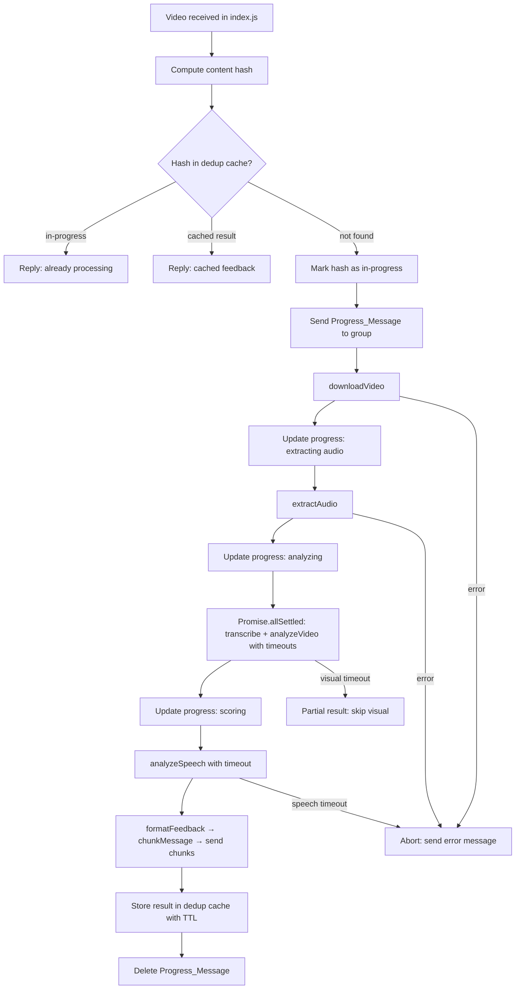

# Design Document: Video Feedback Optimization

## Overview

The video feedback pipeline currently processes user-submitted WhatsApp videos through a sequential chain with no user-visible progress, no duplicate protection, no timeout safety, and no message-length guard. This design adds five orthogonal improvements to `ai/feedback.js` and its dependencies:

1. **Progress notifications** — immediate acknowledgement + live stage updates via WhatsApp message edits
2. **Deduplication cache** — in-memory hash-keyed store that prevents re-processing identical videos
3. **API timeouts** — per-call configurable timeouts with graceful degradation for optional stages
4. **Parallel frame extraction** — already partially implemented; formalized and hardened
5. **Feedback chunking** — split long messages at newline boundaries before sending

All changes are confined to the `ai/` directory and a small addition to `index.js` for the chunked-send helper. No schema changes are required.

---

## Architecture

The optimized pipeline follows this flow:



The `generateFeedback` function in `ai/feedback.js` is the single entry point. `index.js` calls it and handles chunked sending. A new `ai/dedupCache.js` module owns the in-memory cache. A new `ai/pipeline.js` module owns the timeout wrapper and stage logger.

---

## Components and Interfaces

### `ai/pipeline.js` — Timeout wrapper + stage logger

```js
/**
 * Wraps a promise with a timeout. Rejects with a TimeoutError after ms.
 * @param {Promise} promise
 * @param {number} ms
 * @param {string} label  — used in the rejection message
 * @returns {Promise}
 */
export function withTimeout(promise, ms, label)

/**
 * Returns a stage timer object for structured logging.
 * @param {string} stageName
 * @returns {{ end: (error?: Error) => void }}
 */
export function startStage(stageName)
```

`startStage` logs `[PIPELINE] stageName START ts=<epoch>` immediately and returns an object whose `.end(err?)` method logs `[PIPELINE] stageName DONE|FAIL elapsed=<ms> [error=<msg>]`.

### `ai/dedupCache.js` — In-memory deduplication cache

```js
/**
 * Computes a fast hash of a Buffer (video content).
 * Uses Node's built-in crypto.createHash('sha256').
 * @param {Buffer} buffer
 * @returns {string}  hex digest
 */
export function hashBuffer(buffer)

/**
 * Cache states for a given hash key:
 *   'processing'  — pipeline is running
 *   string        — completed feedback text (cached result)
 *   undefined     — not in cache
 */

export const dedupCache  // Map<string, 'processing' | string>

/**
 * Marks a hash as in-progress.
 */
export function markProcessing(hash)

/**
 * Stores a completed result and schedules TTL removal after CACHE_TTL_MS.
 * @param {string} hash
 * @param {string} result  — formatted feedback text
 */
export function storeResult(hash, result)

/**
 * Returns the current cache state for a hash.
 * @param {string} hash
 * @returns {'processing' | string | undefined}
 */
export function getCacheEntry(hash)

/**
 * Removes a hash from the cache (used by TTL timer and tests).
 */
export function evict(hash)

// Default TTL: 300_000 ms (300 seconds)
export const CACHE_TTL_MS = 300_000
```

### `ai/feedback.js` — Updated pipeline orchestrator

`generateFeedback` gains two new parameters:

```js
/**
 * @param {object}  msg
 * @param {string}  user
 * @param {number}  durationSeconds
 * @param {string|null} questionTopic
 * @param {string|null} questionText
 * @param {object|null} sock
 * @param {object}  [opts]
 * @param {Function} [opts.onProgress]   — async (stage: string) => void
 * @param {number}  [opts.transcribeTimeout]  default 60_000
 * @param {number}  [opts.speechTimeout]      default 45_000
 * @param {number}  [opts.visualTimeout]      default 45_000
 */
export async function generateFeedback(msg, user, durationSeconds, questionTopic, questionText, sock, opts = {})
```

`opts.onProgress` is called with a human-readable stage label at each transition. `index.js` provides a closure that edits the progress WhatsApp message.

### `index.js` — Chunked send + progress message management

Two new helpers added to `index.js`:

```js
/**
 * Splits text into chunks of at most maxLen characters, splitting only at \n.
 * @param {string} text
 * @param {number} maxLen  default 4000
 * @returns {string[]}
 */
function chunkMessage(text, maxLen = 4000)

/**
 * Sends each chunk as a separate WhatsApp message.
 * @param {object} sock
 * @param {string} jid
 * @param {string[]} chunks
 * @param {string[]} [mentions]
 */
async function sendChunks(sock, jid, chunks, mentions = [])
```

The video handler in `index.js` is updated to:
1. Download the raw buffer first (before calling `generateFeedback`) to compute the hash
2. Check the dedup cache; short-circuit if in-progress or cached
3. Send the initial progress message and capture its `key` for later edits
4. Pass an `onProgress` callback that calls `sock.sendMessage` with `{ edit: progressMsgKey, text: newText }`
5. After `generateFeedback` resolves, chunk the result and send all chunks
6. Delete the progress message (or replace it with the first chunk)

---

## Data Models

No new MongoDB schemas are required.

### Dedup cache entry (in-memory only)

| Field | Type | Description |
|-------|------|-------------|
| key | `string` | SHA-256 hex digest of the video buffer |
| value | `'processing'` \| `string` | Either the sentinel or the completed feedback text |
| ttlTimer | `NodeJS.Timeout` | Handle returned by `setTimeout` for TTL eviction |

### Pipeline timeout config (constants / env overrides)

| Constant | Default | Env var |
|----------|---------|---------|
| `TRANSCRIBE_TIMEOUT_MS` | 60 000 | `TRANSCRIBE_TIMEOUT_MS` |
| `SPEECH_TIMEOUT_MS` | 45 000 | `SPEECH_TIMEOUT_MS` |
| `VISUAL_TIMEOUT_MS` | 45 000 | `VISUAL_TIMEOUT_MS` |
| `CACHE_TTL_MS` | 300 000 | `CACHE_TTL_MS` |
| `CHUNK_MAX_LEN` | 4 000 | — |

---

## Correctness Properties

*A property is a characteristic or behavior that should hold true across all valid executions of a system — essentially, a formal statement about what the system should do. Properties serve as the bridge between human-readable specifications and machine-verifiable correctness guarantees.*

Property-based testing is applicable here because the core logic — chunking, deduplication, frame timestamp calculation, null filtering, and log formatting — consists of pure or near-pure functions whose correctness must hold across a wide input space. The PBT library used is **[fast-check](https://github.com/dubzzz/fast-check)** (JavaScript).

---

### Property 1: Stage updates reflect the current stage name

*For any* pipeline stage label string, calling the progress update mechanism with that label should produce an output message that contains that label.

**Validates: Requirements 1.2, 1.3, 1.4**

---

### Property 2: Error messages never expose stack traces

*For any* `Error` object thrown during the pipeline, the user-facing error message produced by the error handler should not contain any line matching the pattern `at ` (stack frame prefix) and should not contain the raw `Error.stack` string.

**Validates: Requirements 1.6**

---

### Property 3: Hash consistency

*For any* video `Buffer`, computing the hash twice should return the same value. For any two `Buffer`s with different content, their hashes should differ.

**Validates: Requirements 2.1**

---

### Property 4: Dedup cache round-trip

*For any* feedback result string stored in the cache under a given hash, retrieving that hash from the cache should return the exact same string.

**Validates: Requirements 2.4**

---

### Property 5: Visual timeout produces partial result with audio sections

*For any* valid `analyzeSpeech` result object, if the visual analysis promise times out (resolves to null via timeout), the formatted feedback should be a non-empty string that contains the audio score section and does not contain a raw error message.

**Validates: Requirements 3.5, 6.1**

---

### Property 6: Null frame filtering

*For any* array of frame extraction results (mix of base64 strings and `null` values), the collected frames passed to the vision API should contain only the non-null entries, in their original order.

**Validates: Requirements 4.2, 4.3**

---

### Property 7: Frame timestamps are evenly distributed

*For any* positive video duration `D` and frame count `N ≥ 1`, the generated extraction timestamps should be strictly increasing, all within `[1, D]`, and evenly spaced such that the gap between consecutive timestamps is approximately `D / (N + 1)`.

**Validates: Requirements 4.4**

---

### Property 8: Chunking preserves content

*For any* string `s`, joining all chunks produced by `chunkMessage(s)` should reconstruct `s` exactly (no characters added or dropped).

**Validates: Requirements 5.1, 5.3**

---

### Property 9: All chunks respect the size limit

*For any* string `s` and limit `L`, every chunk produced by `chunkMessage(s, L)` should have `chunk.length ≤ L`.

**Validates: Requirements 5.1, 5.4**

---

### Property 10: Chunks split only at newline boundaries

*For any* multi-line string `s`, no chunk produced by `chunkMessage(s)` should end with a character that is not `\n` unless it is the last chunk or a single line exceeds the limit.

**Validates: Requirements 5.2**

---

### Property 11: Null visual feedback includes unavailability note

*For any* valid speech analysis result with `null` visual input, the formatted feedback string should contain a substring indicating visual analysis was unavailable (e.g. `"visual analysis"`).

**Validates: Requirements 6.2**

---

### Property 12: Stage logger emits stage name and non-negative elapsed time

*For any* stage name string and any non-negative start time, the log entry produced by `startStage(name).end()` should contain the stage name and an elapsed duration `≥ 0`.

**Validates: Requirements 7.1, 7.2, 7.3, 7.4**

---

## Error Handling

| Scenario | Behaviour |
|----------|-----------|
| Video download fails | Pipeline aborts; progress message replaced with user-friendly error (no stack trace) |
| Audio extraction fails | Pipeline aborts; same error replacement |
| Transcription times out (> 60 s) | Pipeline aborts; user told transcription service is unavailable |
| Speech analysis times out (> 45 s) | Pipeline aborts; user told scoring service is unavailable |
| Visual analysis times out (> 45 s) | Visual section omitted; pipeline continues with partial result; note appended |
| Visual analysis returns null frames | `analyzeVideo` returns `null`; treated identically to visual timeout |
| Duplicate video (in-progress) | No new pipeline started; user notified immediately |
| Duplicate video (cached) | Cached result returned; no API calls made |
| Feedback > 4000 chars | Split into chunks; each sent as separate message |
| Both transcription and visual fail | User told video could not be analyzed; prompted to resubmit |

All user-facing error messages are sanitized: `Error.stack` and internal module paths are never included.

---

## Testing Strategy

### Unit tests (example-based)

- `ai/dedupCache.js`: verify `markProcessing`, `storeResult`, `getCacheEntry`, `evict` with concrete inputs; verify TTL eviction fires after the configured delay (using fake timers via `node:timers/promises` mock or `sinon`)
- `ai/pipeline.js`: verify `withTimeout` rejects after the specified ms; verify `startStage` logs correct format
- `ai/feedback.js`: verify pipeline aborts on transcription timeout; verify pipeline aborts on speech timeout; verify partial result when visual is null; verify total-failure message when both transcription and visual fail
- `index.js` helpers: verify `chunkMessage("")` returns `[""]`; verify single-chunk path for short strings; verify progress message is sent before `downloadVideo` is called

### Property-based tests (fast-check, minimum 100 iterations each)

Each property test is tagged with a comment in the format:
`// Feature: video-feedback-optimization, Property <N>: <property_text>`

| Test | Property | fast-check arbitraries |
|------|----------|------------------------|
| Stage update contains label | Property 1 | `fc.string()` for stage name |
| Error messages strip stack traces | Property 2 | `fc.string()` for error message, construct `Error` |
| Hash consistency | Property 3 | `fc.uint8Array()` for buffer content |
| Dedup cache round-trip | Property 4 | `fc.string()` for feedback text, `fc.hexaString(64)` for hash |
| Visual timeout → partial result | Property 5 | `fc.record(...)` for speech result shape |
| Null frame filtering | Property 6 | `fc.array(fc.option(fc.base64String()))` |
| Frame timestamps evenly distributed | Property 7 | `fc.float({ min: 1, max: 3600 })` for duration, `fc.integer({ min: 1, max: 10 })` for N |
| Chunking preserves content | Property 8 | `fc.string()` |
| All chunks ≤ limit | Property 9 | `fc.string()`, `fc.integer({ min: 1, max: 8000 })` for limit |
| Chunks split at newlines | Property 10 | `fc.array(fc.string()).map(lines => lines.join('\n'))` |
| Null visual → unavailability note | Property 11 | `fc.record(...)` for speech result shape |
| Stage logger format | Property 12 | `fc.string()` for stage name, `fc.nat()` for start time |

### Integration tests

- End-to-end pipeline with a real short video file (< 5 s) against the Groq sandbox — run manually, not in CI
- Verify progress message is sent and edited during a real run
- Verify dedup cache prevents a second pipeline run when the same video is submitted twice within 300 s
